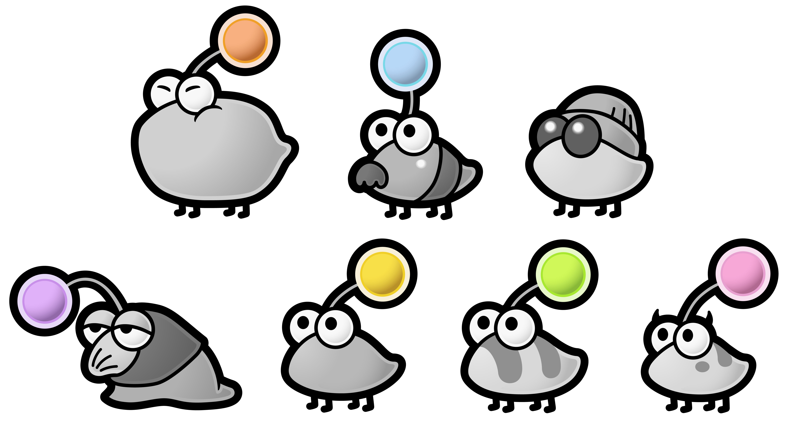

# `minpunit.h` Test Framework

The Punies are a species of small quadrupedal creatures which resemble insects.
They live in the Great Tree located in the Boggly Woods.
Mario must use them to defeat a rival clan, the Jabbies, twice in the Great Tree.

[](https://www.mariowiki.com/Puni)

The name "Puni" is likely derived from「ぷにぷに」(punipuni),
a Japanese word describing something squishy,
but also resembles the English word "puny", meaning "small".

## @librity's Features

- [x] Colors!
- [x] Divider with executable name.
- [ ] More assertions:
  - [ ] `memcmp` assertion: `mu_assert_mem_eq(void* expected, void*  result, size_t size)`

## About

Minunit is a minimal unit testing framework for C/C++ self-contained in a
single header file.

It provides a way to define and configure test suites and a few handy assertion
types. It reports the summary of the number of tests run, number of assertions
and time elapsed.

Note that this project is based on:
http://www.jera.com/techinfo/jtns/jtn002.html

## How to use it

This is a minimal test suite written with minunit:

```c
#include "minunit.h"

MU_TEST(test_check) {
	mu_check(5 == 7);
}
MU_TEST_SUITE(test_suite) {
	MU_RUN_TEST(test_check);
}

MU_MAIN {
	MU_DIVIDER;
	MU_RUN_SUITE(test_suite);
	MU_REPORT();
	return MU_EXIT_CODE;
}
```

Which will produce the following output (with colors):

```elixir
===================== RUNNING ./test.out =====================
F
test_check failed:
	readme_sample.c:4: 5 == 7


1 tests, 1 assertions, 1 failures

Finished in 0.00032524 seconds (real) 0.00017998 seconds (proc)
```

Check out `minunit_example.c` to see a complete example. Compile with something
like:

```bash
$ gcc minunit_example.c -lrt -lm -o minunit_example
```

Don't forget to add `-lrt` for the timer and `-lm` for linking the function `fabs`
used in `mu_assert_double_eq`.

## Setup and teardown functions

One can define setup and teardown functions and configure the test suite to run
them by using the macro `MU_SUITE_CONFIGURE` with within a `MU_TEST_SUITE`
declaration.

## Assertion types

`mu_check(condition)`: will pass if the condition is evaluated to `true`, otherwise
it will show the condition as the error message

`mu_fail(message)`: will fail and show the message

`mu_assert(condition, message)`: will pass if the condition is `true`, otherwise it
will show the failed condition and the message

`mu_assert_int_eq(expected, result)`: it will pass if the two numbers are
equal or show their values as the error message

`mu_assert_double_eq(expected, result)`: it will pass if the two values
are almost equal or show their values as the error message. The value of
`MINUNIT_EPSILON` sets the threshold to determine if the values are close enough.

`mu_assert_string_eq(expected, result)`: it will pass if both C-strings are equal.

## Authors

Luis Geniole <luis.geniole@yandex.com>

Original Framework: David Siñuela Pastor <siu.4coders@gmail.com>
